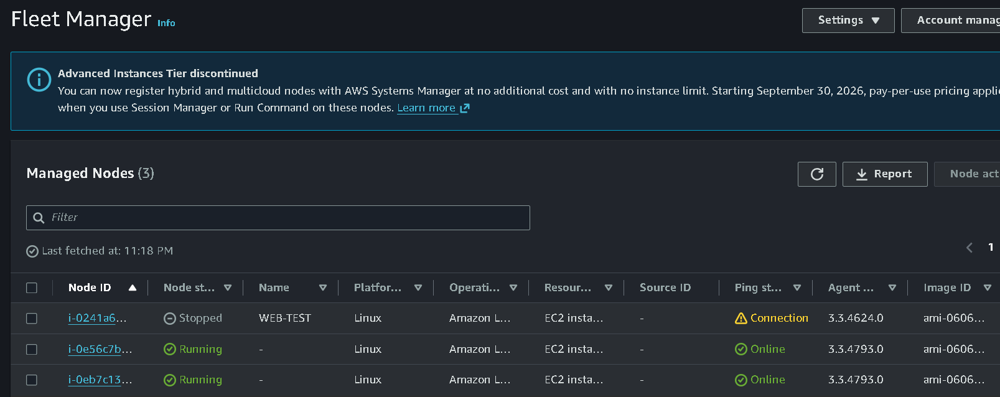
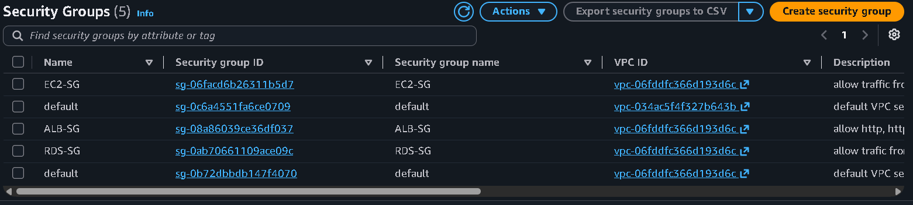
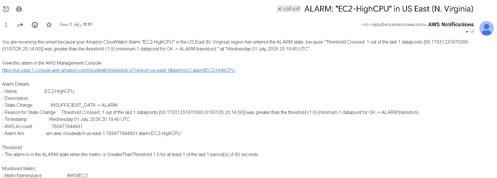

# AWS Secure & Highly Available 3-Tier Web Application

<div align="center">

[](https://aws.amazon.com)
[](https://aws.amazon.com/vpc)
[](https://aws.amazon.com/rds)
[](#test-3--waf-blocking)
[](#validation-tests)

</div>

> A fully deployed and validated three-tier web application on AWS — built manually through the console following the **AWS Well-Architected Framework**, then documented for real-world understanding and interview readiness.

---

## Table of Contents

- [Project Specs](#project-specs)
- [Architecture](#architecture)
- [Architecture Decisions](#architecture-decisions)
- [AWS Services Used](#aws-services-used)
- [Security Design](#security-design)
- [High Availability](#high-availability)
- [Monitoring and Alerting](#monitoring-and-alerting)
- [Validation Tests](#validation-tests)
- [Screenshots](#screenshots)
- [Deployment Steps](#deployment-steps)
- [Cost Considerations](#cost-considerations)
- [Lessons Learned](#lessons-learned)
- [Future Improvements](#future-improvements)
- [Cleanup](#cleanup)
- [Author](#author)

---

## Project Specs

| Property | Value |
|---|---|
| **Region** | `us-east-1` (N. Virginia) |
| **VPC CIDR** | `10.0.0.0/16` |
| **Availability Zones** | `us-east-1a`, `us-east-1b` |
| **Subnets** | 6 total — 2 public, 2 app-private, 2 db-private |
| **EC2 instance type** | `t3.micro` (Amazon Linux 2023) |
| **RDS engine** | MySQL 8.4.8, `db.m7g.large`, Multi-AZ |
| **RDS storage** | 20 GiB, gp3, 3000 IOPS, 125 MiB/s |
| **Auto Scaling** | Min 2 / Desired 2 / Max 4 |
| **WAF rules** | 3 AWS managed rule sets (925 total WCU) |
| **Access method** | AWS Systems Manager Session Manager — no SSH, no port 22 |

---

## Architecture


**Traffic flow:**

```
Internet
    │
    ▼
AWS WAF  ←── 3 managed rule sets: Common + KnownBadInputs + AmazonIpReputation
    │
    ▼
Application Load Balancer  ←── Internet-facing, spans both AZs
    │                           DNS: Production-ALB-1120090886.us-east-1.elb.amazonaws.com
    ├──── us-east-1a ─────────────────────────────────────┐
    │         NAT-A              EC2 (App-Private-A)        │
    │         10.0.1.0/24        10.0.11.0/24              │
    │                                    │                  │
    │                            RDS Primary DB             │
    │                            DB-Private-A 10.0.21.0/24 │
    │                                                       │
    └──── us-east-1b ─────────────────────────────────────┘
              NAT-B              EC2 (App-Private-B)
              10.0.2.0/24        10.0.12.0/24
                                        │
                                RDS Standby DB
                                DB-Private-B 10.0.22.0/24

Observability:
  VPC Flow Logs ──► CloudWatch Logs (12 active log streams)
  CloudWatch Alarms ──► SNS Production-Alerts ──► Email
  CloudTrail ──► S3 (audit log bucket)
  AWS Systems Manager ──► EC2 (no open port 22)
```

---

## Architecture Decisions

Every service was chosen for a specific reason. Here is the thinking behind each one:

**Why AWS WAF before the ALB?**
The ALB is the only public-facing entry point. Putting WAF directly in front means every HTTP request is inspected before it reaches any compute. A request that WAF blocks never touches the EC2 tier at all — no CPU used, no application code executed. This is the correct placement for a defense-in-depth approach.

**Why 3 WAF rule sets instead of 1?**
- `AWSManagedRulesCommonRuleSet` — blocks OWASP Top 10 (SQLi, XSS, path traversal). The baseline.
- `AWSManagedRulesKnownBadInputsRuleSet` — blocks known exploit payloads and bad user agents.
- `AWSManagedRulesAmazonIpReputationList` — blocks IPs that AWS has identified as malicious across all customers.
Together they blocked 539 of 699 requests (77%) in testing with no configuration beyond enabling them.

**Why EC2 in private subnets with no public IP?**
If an EC2 instance had a public IP and a security group misconfiguration happened, it would be reachable from the internet. Private subnets remove that risk entirely — even a misconfigured security group cannot make an instance reachable if there is no public route to it.

**Why RDS in separate DB-private subnets with no internet route?**
Isolation principle: the database should be unreachable from anywhere except the application tier. The DB-private subnets have no route table entry for the internet at all. Even if RDS-SG were deleted, the routing alone prevents access from outside the app tier.

**Why RDS Multi-AZ?**
A single-AZ RDS instance means the database is a single point of failure — if `us-east-1b` has an issue, the entire application loses its data layer. Multi-AZ maintains a synchronous standby in a second AZ and promotes it automatically in under 60 seconds. This was verified by running a failover test (see Validation Tests).

**Why two NAT Gateways instead of one?**
One NAT Gateway shared between both AZs means the EC2 instances in `us-east-1a` depend on the NAT in `us-east-1b` (or vice versa) for outbound internet access. If that AZ has an issue, both AZs lose outbound connectivity even though only one AZ is affected. Two NAT Gateways make each AZ fully self-contained.

**Why AWS Systems Manager Session Manager instead of SSH?**
SSH requires an open inbound port 22 on a security group and a key pair file. SSM Session Manager requires neither — it uses IAM for authentication, and all session activity is logged to CloudTrail. There is no port 22 rule anywhere in this architecture.

**Why no Route 53 or ACM in this version?**
The project demonstrates the core architecture — VPC design, compute, database, security, and observability. Route 53 and ACM are DNS and certificate features that sit on top of a working architecture. They are listed as Phase 2 improvements and can be added to any working ALB without changes to the underlying design.

---

## AWS Services Used

| Service | Purpose |
|---|---|
| Amazon VPC | Isolated network — 6 subnets across 2 AZs |
| Internet Gateway | Single inbound/outbound path for public subnets |
| NAT Gateway (×2) | Outbound internet for private EC2 instances — one per AZ |
| AWS WAF | Block OWASP Top 10, bad inputs, and malicious IPs before traffic reaches EC2 |
| Application Load Balancer | Distribute HTTP traffic across both AZs, health-check each instance |
| Amazon EC2 + Auto Scaling | Application tier — scales 2→4 instances based on CPU |
| Amazon RDS MySQL 8.4.8 | Managed database with Multi-AZ, encryption, automated backups |
| AWS IAM | EC2 role with only the permissions SSM needs — nothing more |
| AWS Systems Manager | Shell access to EC2 with no open port 22 |
| Amazon CloudWatch | Metrics, dashboard, and 2 alarms (CPU + unhealthy targets) |
| Amazon SNS | Email alerts when CloudWatch alarms fire |
| AWS CloudTrail | Full API call audit log to S3 |
| VPC Flow Logs | Network traffic records to CloudWatch Logs |
| Amazon S3 | CloudTrail audit log destination |

---

## Security Design

### Network segmentation

| Tier | Subnets | Internet access | Who can reach it |
|---|---|---|---|
| Public | 10.0.1.0/24, 10.0.2.0/24 | Direct via IGW | Internet (WAF + ALB only) |
| App-private | 10.0.11.0/24, 10.0.12.0/24 | Outbound only via NAT | ALB (port 80) |
| DB-private | 10.0.21.0/24, 10.0.22.0/24 | None | EC2-SG (port 3306) |

### Security group chain

```
ALB-SG  ←── accepts 80 and 443 from 0.0.0.0/0
  │
  └─► EC2-SG  ←── accepts port 80 from ALB-SG only
          │
          └─► RDS-SG  ←── accepts port 3306 from EC2-SG only
```

No rule uses a raw CIDR — every rule references the security group in front of it. If the ALB is removed, EC2 becomes unreachable automatically.

### Security controls checklist

| Control | Status |
|---|---|
| EC2 in private subnets, no public IP | ✅ |
| RDS in private subnets, no internet route | ✅ |
| Security group chaining (no raw CIDRs) | ✅ |
| AWS WAF — 3 managed rule sets | ✅ |
| IAM least privilege (SSM only) | ✅ |
| No SSH — Systems Manager access only | ✅ |
| RDS encryption at rest (AWS KMS) | ✅ |
| RDS automated backups — 7-day retention | ✅ |
| CloudTrail audit logging | ✅ |
| VPC Flow Logs | ✅ |
| CloudWatch alarms with SNS notification | ✅ |

---

## High Availability

| Component | HA mechanism |
|---|---|
| ALB | Spans both AZs — routes only to healthy instances |
| EC2 | Auto Scaling Group — min 2 instances, one per AZ |
| RDS | Multi-AZ — synchronous standby, automatic failover tested |
| NAT | One per AZ — outbound access survives an AZ event |

If an entire AZ fails: the ALB stops routing to it immediately (health check), the Auto Scaling Group launches a replacement in the healthy AZ, and RDS fails over to the standby in under 60 seconds. No manual intervention required.

---

## Monitoring and Alerting

**CloudWatch alarms:**

| Alarm | Metric | Threshold | Action |
|---|---|---|---|
| `EC2-HighCPU` | `AWS/EC2 CPUUtilization` | > 1.0 for 1 min | SNS → email |
| `ALB-Unhealthy-Targets` | `AWS/ApplicationELB UnHealthyHostCount` | > 0 | SNS → email |

**SNS topic:** `Production-Alerts` — email subscription confirmed to `kareemrabie2020@gmail.com`.

**VPC Flow Logs:** 12 active log streams capturing all ENI traffic to CloudWatch Logs.

**CloudTrail:** Logging all management events including SSM sessions, Auto Scaling activity, and EC2 lifecycle events.

---

## Validation Tests

Every layer was tested under real failure conditions before the project was finalized.

---

### Test 1 — RDS Multi-AZ Failover

**How:** Triggered via Actions → Reboot with Failover on the primary RDS instance in the console.

**Result:** ✅ Passed

The RDS Events log (54 total events) shows the complete sequence:

| Time (UTC+3) | Event |
|---|---|
| 22:57 | Multi-AZ instance failover started |
| 22:57 | DB instance restarted |
| 22:58 | The user requested a failover of the DB instance |
| 22:58 | Multi-AZ instance failover completed |

**Total failover time: under 1 minute.** After failover, the instance in `us-east-1b` became the primary. No application-level configuration change was needed.


---

### Test 2 — Auto Scaling Group

**How:** Monitored ASG activity while ALB distributed traffic across both instances.

**Result:** ✅ Passed

Production-ASG maintained desired capacity of 2 with scaling limits 2–4. Both EC2 instances were confirmed Online and reachable through SSM Fleet Manager.

---

### Test 3 — WAF Blocking

**How:** Sent an XSS payload directly to the ALB DNS endpoint:

```
http://production-alb-1120090886.us-east-1.elb.amazonaws.com/?q=<script>alert(1)</script>
```

**Result:** ✅ Passed — HTTP 403 Forbidden returned immediately.

**WAF Summary over the test period:**

| Metric | Count |
|---|---|
| Total requests | 699 |
| Allowed | 160 |
| **Blocked** | **539 (77%)** |
| CAPTCHA | 0 |

The `AWSManagedRulesCommonRuleSet` blocked the XSS attempt. The high block rate reflects the IP reputation and known-bad-inputs rules also firing against probe traffic.


---

### Test 4 — SNS Email Notification

**How:** The `EC2-HighCPU` alarm transitioned from INSUFFICIENT_DATA to ALARM state.

**Result:** ✅ Passed

Email delivered by `no-reply@sns.amazonaws.com` to `kareemrabie2020@gmail.com` within 1 minute of the alarm state change. The email included the alarm ARN, threshold details, and a direct link to the alarm in the console.


---

### Test 5 — Systems Manager Session Manager

**How:** Connected to running EC2 instances via SSM Fleet Manager — no SSH key, no open port 22.

**Result:** ✅ Passed

SSM Fleet Manager showed 3 managed nodes. Two were Online and available for shell access. All session activity was recorded in CloudTrail under `UpdateInstanceInfo` events from `ssm.amazonaws.com`.



---

### Test 6 — VPC Flow Logs

**How:** Checked CloudWatch Logs after running the WAF test above.

**Result:** ✅ Passed

12 active log streams captured traffic for all VPC network interfaces including the ALB ENIs and RDS ENIs (including the secondary `db-DEBH2LKPWPSAYA6SDRWQNNJ64Q-secondary` stream). Log records showed ACCEPT for legitimate traffic and NODATA for idle periods.


---

### Test 7 — CloudTrail Audit

**How:** Opened CloudTrail Event History after SSM and ASG activity.

**Result:** ✅ Passed

Events recorded: `UpdateInstanceInfo` (SSM), `UpdateAutoScalingGroup`, `CreateTags` — all with correct source IPs, user agents (`ssm.amazonaws.com`, `autoscaling.amazonaws.com`), and timestamps.


---

### Validation summary

| Test | Method | Result |
|---|---|---|
| RDS Multi-AZ failover | Reboot with Failover | ✅ Completed in under 60 seconds |
| Auto Scaling | ASG activity | ✅ Maintained desired capacity |
| WAF XSS blocking | Crafted HTTP request | ✅ HTTP 403, 539/699 requests blocked |
| SNS email notification | CloudWatch alarm trigger | ✅ Email delivered within 1 minute |
| SSM Session Manager | Fleet Manager shell | ✅ No port 22, IAM-authenticated |
| VPC Flow Logs | CloudWatch Logs review | ✅ 12 streams, all ENIs captured |
| CloudTrail auditing | Event History review | ✅ All API calls recorded |

---

## Screenshots

### VPC and subnets


### Security groups



### Application Load Balancer


### Auto Scaling Group


### Amazon RDS — Multi-AZ


### AWS WAF


### CloudWatch Alarms


### SNS Topic



---

## Deployment Steps

The full phase-by-phase build guide is in [`docs/deployment.md`](docs/deployment.md).

High-level order (14 phases):

```
1.  VPC (10.0.0.0/16), 6 subnets, Internet Gateway
2.  NAT Gateway × 2, one per AZ with Elastic IP
3.  Route tables — public-rt (2 subnets), private-rt (4 subnets)
4.  Security Groups — ALB-SG, EC2-SG, RDS-SG
5.  IAM Role — AmazonSSMManagedInstanceCore for EC2
6.  RDS MySQL 8.4.8 Multi-AZ with DB subnet group
7.  EC2 Launch Template — Amazon Linux 2023, IMDSv2 user-data
8.  Auto Scaling Group — min 2 / desired 2 / max 4
9.  Target Group + ALB — internet-facing, both AZs
10. Enable WAF on ALB — 3 managed rule sets
11. VPC Flow Logs — to CloudWatch Logs
12. CloudTrail — to encrypted S3 bucket
13. CloudWatch alarms + SNS email subscription
14. Validate all 7 test cases above
```

---

## Cost Considerations

**This project used production-grade sizing to demonstrate real architecture.** For a pure learning environment, downsizing is possible.

| Resource | This project | Free Tier alternative |
|---|---|---|
| EC2 | `t3.micro` × 2 | `t2.micro` × 1 |
| RDS | `db.m7g.large` Multi-AZ | `db.t3.micro` Single-AZ |
| NAT Gateway | 2 (one per AZ) | 1 shared |

**Estimated hourly cost at minimum (this config):**
- 2× t3.micro: ~$0.021/hr
- 2× NAT Gateway: ~$0.090/hr
- db.m7g.large Multi-AZ: ~$0.448/hr
- ALB: ~$0.008/hr

**Total: ~$0.57/hr (~$13.60/day)**

> The db.m7g.large is the main cost driver. For a learning project, using db.t3.micro Multi-AZ (~$0.034/hr) brings the total down to ~$0.15/hr. Delete NAT Gateways and RDS first when not testing — they bill every hour even when idle.

---

## Lessons Learned

**RDS failover happened faster than expected.** The failover completed in under 60 seconds end-to-end. What was surprising was that the application-side database connection recovered without any intervention — the endpoint DNS updated automatically to point to the new primary.

**WAF blocked 77% of requests without any custom rules.** The three managed rule sets required no tuning to block the XSS test and a significant amount of probe traffic that hit the ALB during testing. Starting in Count mode first (before Block mode) is important — some legitimate requests might trigger rules unexpectedly.

**Two CloudWatch alarms is better than one.** Separate alarms for `EC2-HighCPU` and `ALB-Unhealthy-Targets` tell you different things. A high CPU alarm tells you the application is under load. An unhealthy targets alarm tells you the load balancer cannot reach an instance. Both together give much faster diagnosis during an incident.

**IMDSv2 requires a token step in user-data scripts.** The first version of the user-data script used the old IMDSv1 single-step metadata call which failed silently when IMDSv2 was required. The correct pattern is a PUT request to get a token first, then pass that token as a header in the metadata GET.

**SSM agent is pre-installed on Amazon Linux 2023** but requires the correct IAM role to register. The common mistake is forgetting to attach the instance profile to the launch template — the instances launch but never appear in Fleet Manager.

---

## Future Improvements

**Phase 2 — HTTPS and DNS**
- Request ACM certificate for a custom domain
- Add Route 53 hosted zone with alias A record to ALB
- Update ALB HTTP listener to redirect to HTTPS

**Phase 3 — Infrastructure as Code**
- Rebuild the full stack with Terraform
- Use S3 remote state + DynamoDB state locking
- Separate modules: network, compute, database, monitoring

**Phase 4 — CI/CD**
- GitHub Actions pipeline: build → Docker image → push to ECR → deploy to ECS
- Zero-downtime rolling deployment

**Phase 5 — Containers**
- Migrate EC2 application tier to ECS with Fargate
- Eliminates AMI management and OS patching

---

## Cleanup

To avoid ongoing charges after testing:

```
1. Delete Auto Scaling Group  →  terminates EC2 instances
2. Delete ALB and Target Group
3. Delete RDS instance  (no final snapshot needed for a test project)
4. Delete NAT Gateways  →  release Elastic IPs
5. Delete VPC  →  removes subnets, route tables, IGW automatically
6. Disassociate and delete WAF Web ACL
7. Empty and delete the CloudTrail S3 bucket
8. Delete the CloudWatch Log Group for VPC Flow Logs
```

NAT Gateways and RDS bill every hour — delete those first.

---

## Author

**Kareem Rabea**
AWS Cloud Engineer | Preparing for AWS Solutions Architect Associate (SAA-C03)

[](https://www.linkedin.com/in/kareem-rabiee)
[](https://github.com/kareemrabiee)
