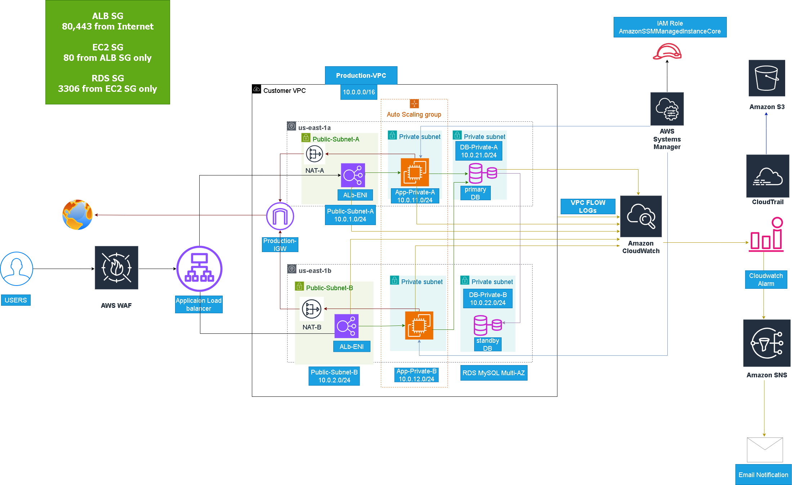

# AWS Secure 3-Tier Architecture

Production-grade AWS 3-Tier Web Application Architecture.

## Architecture

---

## Services Used

- Amazon VPC
- Public & Private Subnets
- Internet Gateway
- NAT Gateway
- Application Load Balancer
- Auto Scaling Group
- Amazon EC2
- Amazon RDS MySQL Multi-AZ
- AWS WAF
- AWS Systems Manager
- Amazon CloudWatch
- Amazon SNS
- AWS CloudTrail
- VPC Flow Logs

---

## Architecture Flow

Users

↓

AWS WAF

↓

Application Load Balancer

↓

EC2 Auto Scaling Group

↓

RDS MySQL Multi-AZ

---

## Security Design

- No public EC2 instances
- EC2 deployed in private subnets
- ALB exposed to internet
- RDS private only
- Security Group chaining
- HTTPS using ACM
- AWS WAF protection
- Systems Manager instead of SSH

---

## Monitoring

- CloudWatch Dashboard
- CloudWatch Alarms
- SNS Email Notifications
- CloudTrail Auditing
- VPC Flow Logs

---

## High Availability

- Multi-AZ Architecture
- Multi-AZ RDS
- Auto Scaling Group
- Application Load Balancer

---

## Validation Tests

### RDS Failover

Successfully tested.

### Auto Scaling

Successfully launched additional EC2 instances under load.

### WAF

SQL Injection requests blocked successfully.

### SNS

Email notifications received successfully.

### CloudTrail

Management events logged successfully.

### VPC Flow Logs

Traffic logs collected successfully.
