# AWS Secure & Highly Available 3-Tier Web Application

<div align="center">

[](https://aws.amazon.com)
[](https://aws.amazon.com/ec2)
[](https://aws.amazon.com/rds)
[](https://aws.amazon.com/waf)
[](https://aws.amazon.com/cloudwatch)
[](#validation-tests)
[](#aws-saa-c03-alignment)

</div>

> A production-inspired, fully deployed and validated three-tier web application on AWS — built following the **AWS Well-Architected Framework** across Reliability, Security, Performance Efficiency, Cost Optimization, and Operational Excellence pillars.

---

## Table of Contents

- [Project Overview](#project-overview)
- [Architecture](#architecture)
- [Architecture Flow](#architecture-flow)
- [AWS Services Used](#aws-services-used)
- [Security Design](#security-design)
- [High Availability Design](#high-availability-design)
- [Monitoring and Alerting](#monitoring-and-alerting)
- [Validation Tests](#validation-tests)
- [Project Screenshots](#project-screenshots)
- [Repository Structure](#repository-structure)
- [Deployment Guide](#deployment-guide)
- [Cost Optimization](#cost-optimization)
- [Skills Demonstrated](#skills-demonstrated)
- [Lessons Learned](#lessons-learned)
- [Future Improvements](#future-improvements)
- [AWS SAA-C03 Alignment](#aws-saa-c03-alignment)
- [Author](#author)

---

## Project Overview

This project implements a **complete production-style three-tier web application** on AWS, designed and deployed manually through the AWS Console before being redefined as Infrastructure as Code with Terraform.

The architecture prioritizes four goals:

| Goal | Implementation |
|---|---|
| High availability | Multi-AZ across `us-east-1a` and `us-east-1b` |
| Security hardening | No public EC2 or RDS; WAF; SSM instead of SSH |
| Operational visibility | CloudWatch dashboard, SNS alerts, CloudTrail audit trail |
| Cost efficiency | Burstable instances; resources deleted after validation |

---

## Architecture


> Full architecture built and validated in AWS `us-east-1` across two Availability Zones.

---

## Architecture Flow

```
Internet
    │
    ▼
AWS WAF                   ← SQL injection, XSS, and OWASP Top 10 protection
    │
    ▼
Application Load Balancer ← Internet-facing, spans Public-Subnet-A and Public-Subnet-B
(inside VPC, public subnets)
    │
    ├── us-east-1a ──────────────────────────────────────────────────────┐
    │       │                                                             │
    │   NAT-A                     EC2 (App-Private-A)   RDS Primary DB   │
    │   (Public-Subnet-A)         (10.0.11.0/24)        (DB-Private-A)   │
    │                                                                     │
    └── us-east-1b ──────────────────────────────────────────────────────┘
            │
        NAT-B                     EC2 (App-Private-B)   RDS Standby DB
        (Public-Subnet-B)         (10.0.12.0/24)        (DB-Private-B)
                                       │
                                       ▼
                              Auto Scaling Group
                              (min 2 / desired 2 / max 4)

Observability (outside traffic path)
    ├── VPC Flow Logs ──► CloudWatch Logs
    ├── CloudWatch Metrics ──► Alarms ──► SNS ──► Email
    ├── CloudTrail ──► S3 (audit-logs bucket)
    └── AWS Systems Manager ──► EC2 access (no SSH, no open port 22)
```

---

## AWS Services Used

| Layer | Service | Role |
|---|---|---|
| DNS | Amazon Route 53 | Domain routing to ALB |
| Edge security | AWS WAF | Block OWASP Top 10, SQL injection, XSS |
| Load balancing | Application Load Balancer | Distribute traffic across both AZs |
| Compute | Amazon EC2 + Auto Scaling Group | Application tier in private subnets |
| Database | Amazon RDS MySQL 8.0 Multi-AZ | Persistent storage with automatic failover |
| Networking | VPC, Subnets, IGW, NAT Gateway, Route Tables | Full network isolation |
| Access management | AWS IAM | Least-privilege roles for EC2 and services |
| Remote access | AWS Systems Manager Session Manager | No SSH, no port 22 |
| Monitoring | Amazon CloudWatch | Metrics, dashboards, alarms |
| Alerting | Amazon SNS | Email notifications on threshold breach |
| Audit | AWS CloudTrail | Full API call history to S3 |
| Network logging | VPC Flow Logs | Traffic logs to CloudWatch Logs |
| Storage | Amazon S3 | CloudTrail audit log destination |

---

## Security Design

### Network segmentation

```
┌─────────────────────────────────────────────────────────────┐
│  Production-VPC  (10.0.0.0/16)                             │
│                                                             │
│  Public tier     10.0.1.0/24  │  10.0.2.0/24              │
│  ─ ALB nodes, NAT Gateways                                  │
│                                                             │
│  App private     10.0.11.0/24 │  10.0.12.0/24             │
│  ─ EC2 instances, no inbound from internet                  │
│                                                             │
│  DB private      10.0.21.0/24 │  10.0.22.0/24             │
│  ─ RDS only, no internet route at all                       │
└─────────────────────────────────────────────────────────────┘
```

### Security controls checklist

| Control | Detail | Status |
|---|---|---|
| Private application subnets | EC2 not reachable from internet directly | ✅ |
| Private database subnets | RDS has no internet route table entry | ✅ |
| Security group chaining | ALB-SG → EC2-SG → RDS-SG (no raw CIDRs) | ✅ |
| AWS WAF | AWS Managed Rules common rule set | ✅ |
| HTTPS / TLS | ACM certificate on ALB HTTPS listener | ✅ |
| No SSH | Systems Manager Session Manager used instead | ✅ |
| IAM least privilege | EC2 role has only `AmazonSSMManagedInstanceCore` | ✅ |
| RDS encryption at rest | Storage encrypted via AWS KMS | ✅ |
| CloudTrail auditing | Multi-region trail, encrypted S3 bucket | ✅ |
| VPC Flow Logs | Traffic logs to CloudWatch Logs | ✅ |
| Billing alert | AWS Budgets alert at $5 | ✅ |

### Security group rules

| Security group | Inbound | Source |
|---|---|---|
| ALB-SG | TCP 80, 443 | 0.0.0.0/0 (internet) |
| EC2-SG | TCP 80 | ALB-SG only |
| RDS-SG | TCP 3306 | EC2-SG only |

---

## High Availability Design

Every component that can fail is duplicated across both Availability Zones.

| Component | HA mechanism |
|---|---|
| Application Load Balancer | Spans Public-Subnet-A and Public-Subnet-B |
| EC2 compute | Auto Scaling Group, min 2 instances across both AZs |
| Database | RDS Multi-AZ with synchronous standby and automatic failover |
| NAT Gateways | NAT-A in us-east-1a, NAT-B in us-east-1b (independent) |
| Route tables | Per-AZ private route tables point to AZ-local NAT |

If an entire Availability Zone fails, the ALB health checks stop routing to unhealthy targets, the Auto Scaling Group replaces instances in the healthy AZ, and RDS promotes the standby to primary — all automatically, with no manual intervention.

---

## Monitoring and Alerting

### CloudWatch dashboard — `Production-Monitoring`

| Widget | Metric | Namespace |
|---|---|---|
| EC2 CPU utilization | `CPUUtilization` | `AWS/EC2` |
| ALB request count | `RequestCount` | `AWS/ApplicationELB` |
| Healthy host count | `HealthyHostCount` | `AWS/ApplicationELB` |
| Unhealthy host count | `UnHealthyHostCount` | `AWS/ApplicationELB` |
| RDS CPU | `CPUUtilization` | `AWS/RDS` |
| DB connections | `DatabaseConnections` | `AWS/RDS` |

### CloudWatch alarm

- **Threshold:** average EC2 CPU > 70% for 5 consecutive minutes
- **Action:** publishes to SNS topic `Production-Alerts`
- **Subscription:** email notification to the configured address

---

## Validation Tests

Every layer of the architecture was tested under failure conditions before the project was considered complete.

### Live Application Test

The application was successfully deployed behind the Application Load Balancer.

### Home Page

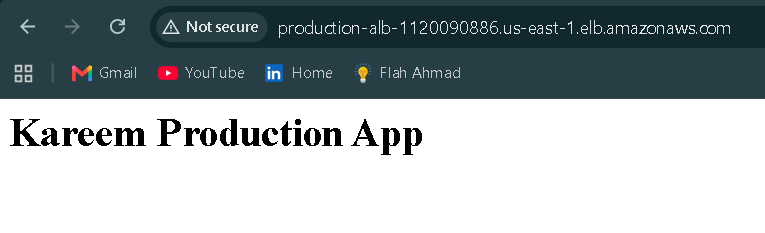

### RDS Multi-AZ failover

> Triggered via **Reboot with Failover** on the primary RDS instance.

The standby in `us-east-1b` was promoted to primary in under 60 seconds. The application's database connection dropped briefly and recovered automatically, with no configuration change required.

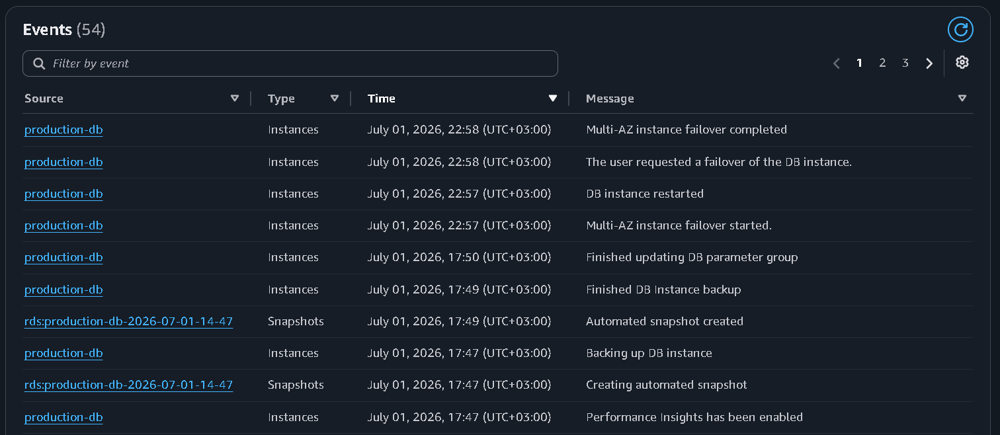

---

### Auto Scaling — scale-out under load

> Simulated CPU load on the running instances to trigger the target tracking policy.

The Auto Scaling Group launched additional EC2 instances and registered them with the ALB target group. The ALB began distributing traffic to new instances after they passed the health check.

---

### AWS WAF — SQL injection and XSS blocking

> Sent crafted HTTP requests containing SQL injection and XSS payloads directly to the ALB endpoint.

Both request types were blocked by the AWS Managed Rules common rule set and logged in the WAF metrics. The application returned an HTTP 403 response for each blocked request.

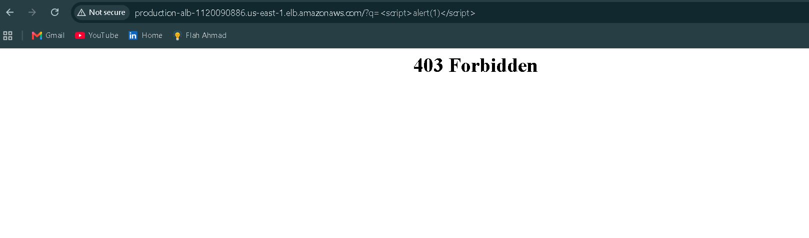

---

### SNS email notifications

> Triggered the CloudWatch CPU alarm by simulating sustained CPU load above 70%.

The SNS topic delivered an email notification within 5 minutes of the alarm entering the ALARM state, and a second notification when it returned to OK.


---

### CloudTrail — API audit logging

> Verified that all API calls (EC2 launch, RDS reboot, WAF association) were recorded in CloudTrail.

All management events were logged to the dedicated S3 audit bucket with log file validation enabled.

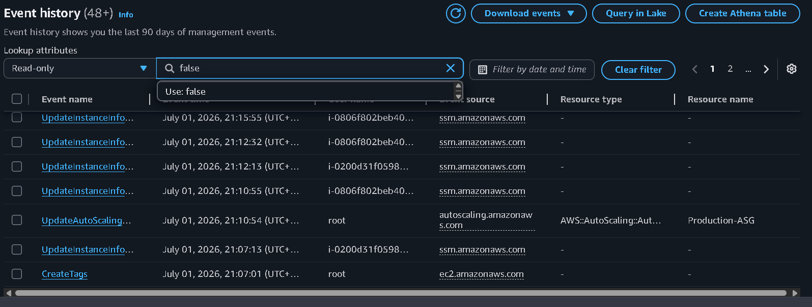

---

### VPC Flow Logs

> Verified that network traffic within the VPC was captured and published to CloudWatch Logs.

Inbound traffic to EC2 through the ALB and outbound traffic through NAT Gateways were both visible in the flow log records.

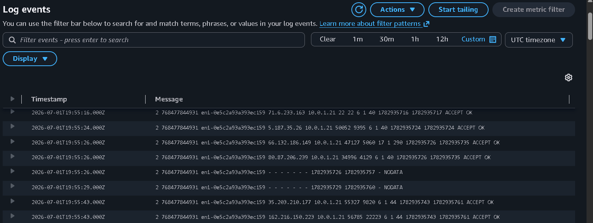

---

### Validation summary

| Test | Method | Result |
|---|---|---|
| RDS Multi-AZ failover | Reboot with failover | ✅ Passed — automatic promotion under 60s |
| Auto Scaling scale-out | Sustained CPU load | ✅ Passed — new instances launched and registered |
| WAF SQL injection blocking | Crafted HTTP requests | ✅ Passed — HTTP 403 returned, logged in WAF |
| WAF XSS blocking | Crafted HTTP requests | ✅ Passed — HTTP 403 returned, logged in WAF |
| SNS email alerting | CPU alarm trigger | ✅ Passed — email delivered within 5 minutes |
| CloudTrail API auditing | Console review of event history | ✅ Passed — all API calls recorded |
| VPC Flow Logs | CloudWatch Logs Insights query | ✅ Passed — all inbound and outbound flows captured |
| Systems Manager access | Session Manager session | ✅ Passed — shell access with no open port 22 |

---

## Project Screenshots

### VPC and subnet layout

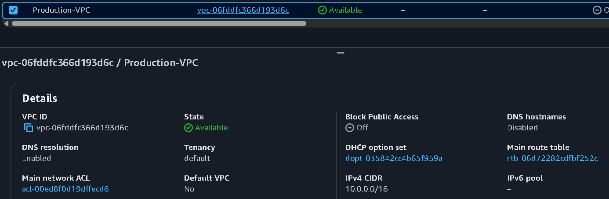

### Application Load Balancer

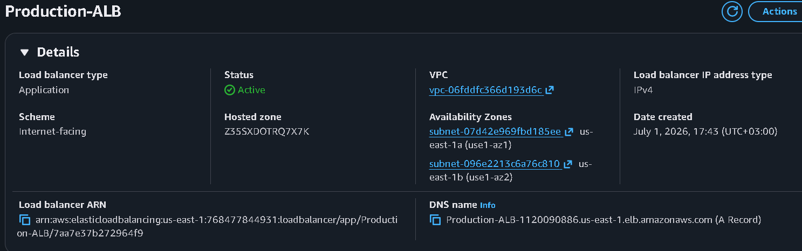

### Auto Scaling Group

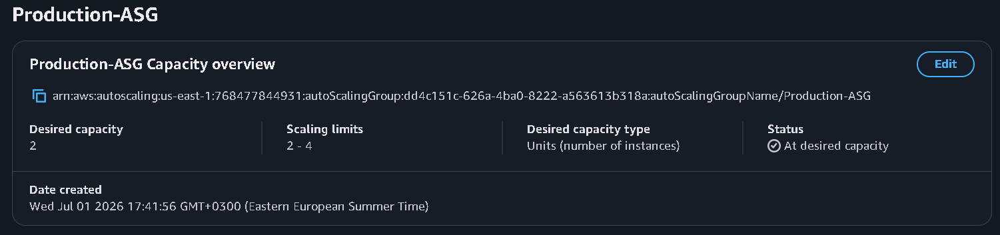

### Amazon RDS — Multi-AZ

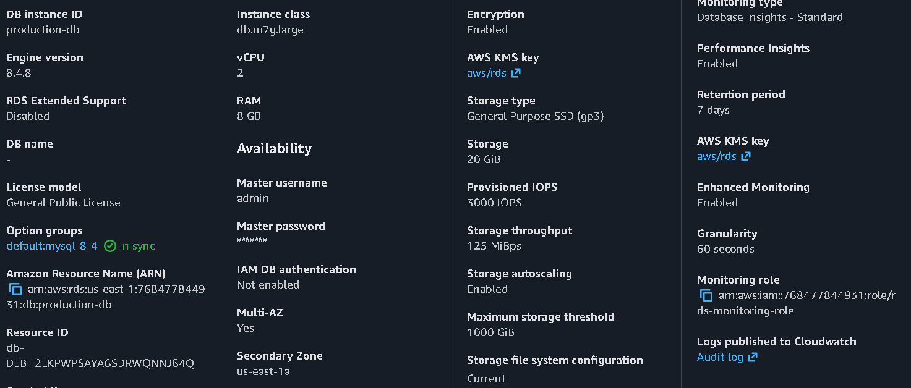

### AWS WAF

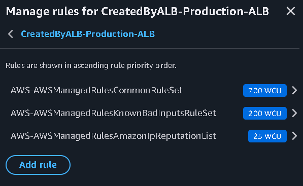

### CloudWatch dashboard

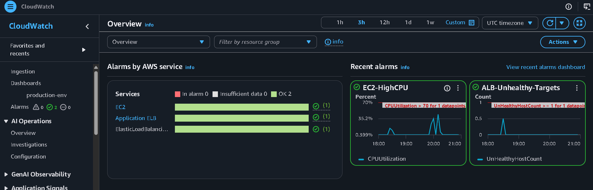

---

## Repository Structure

```
AWS-Secure-Scalable-Web-Application-Architecture/
│
├── README.md                        ← this file
├── architecture/
│   └── architecture-diagram.png     ← full architecture diagram
│
├── screenshots/                     ← AWS Console screenshots, one per build phase
│   ├── 01-vpc.png
│   ├── 02-subnets.png
│   ├── 03-route-tables.png
│   ├── 04-alb.png
│   ├── 05-target-group.png
│   ├── 06-auto-scaling.png
│   ├── 07-rds.png
│   ├── 08-security-groups.png
│   ├── 09-waf.png
│   ├── 10-cloudwatch-dashboard.png
│   ├── 11-cloudtrail.png
│   └── 12-sns.png
│
├── validation-tests/                ← evidence screenshots from failure testing
│   ├── rds-failover.png
│   ├── auto-scaling.png
│   ├── waf-blocking.png
│   ├── sns-notification.png
│   ├── cloudtrail.png
│   └── vpc-flow-logs.png
│
├── docs/
│   ├── deployment.md                ← phase-by-phase build instructions
│   ├── security.md                  ← security controls reference
│   └── cost-analysis.md             ← cost breakdown and optimization notes
│
└── terraform/                       ← planned IaC version (Phase 2)
    └── (coming soon)
```

---

## Deployment Guide

The full step-by-step build guide is in [`docs/deployment.md`](docs/deployment.md).

High-level phases:

1. Create VPC (`10.0.0.0/16`), 6 subnets, Internet Gateway, route tables
2. Create 2 NAT Gateways with Elastic IPs (one per AZ)
3. Create Security Groups (ALB-SG → EC2-SG → RDS-SG chain)
4. Create IAM role + instance profile for Systems Manager
5. Create RDS MySQL 8.0 Multi-AZ with subnet group
6. Create EC2 Launch Template with IMDSv2 user-data script
7. Create Auto Scaling Group (min 2 / desired 2 / max 4) with ELB health check
8. Create Target Group + Application Load Balancer with HTTP:80 and HTTPS:443 listeners
9. Request ACM certificate and configure Route 53 alias record
10. Associate AWS WAF web ACL with the ALB
11. Enable VPC Flow Logs → CloudWatch Logs
12. Create CloudTrail trail → encrypted S3 bucket
13. Create CloudWatch dashboard, CPU alarm, and SNS email subscription
14. Run all validation tests and document results

---

## Cost Optimization

| Decision | Reason |
|---|---|
| `t3.micro` EC2, `db.t3.micro` RDS | Stays within or close to AWS Free Tier for learning and demos |
| Two NAT Gateways | Full AZ resilience; a single NAT saves cost but is a single point of failure for outbound traffic |
| Systems Manager instead of Bastion Host | Eliminates a running EC2 instance and Elastic IP dedicated to management |
| Resources deleted after validation | NAT Gateways and Multi-AZ RDS bill hourly while idle |
| Auto Scaling target tracking at 70% CPU | Avoids over-provisioning while keeping headroom for load spikes |

Estimated hourly cost while running (us-east-1, approximate):
- 2× t3.micro EC2: ~$0.02/hr
- 2× NAT Gateway: ~$0.09/hr
- db.t3.micro Multi-AZ RDS: ~$0.034/hr
- ALB: ~$0.008/hr + LCU charges

**Total: under $0.16/hr** (~$3.80/day). Run `terraform destroy` or stop resources when not actively testing.

---

## Skills Demonstrated

**Architecture:** Multi-AZ VPC design, public/private/database subnet segmentation, security group chaining, NAT Gateway configuration.

**Security:** AWS WAF with managed rules, IAM least-privilege, Systems Manager Session Manager (no SSH), RDS encryption at rest, CloudTrail audit logging.

**Compute:** EC2 Launch Templates, Auto Scaling Groups with target tracking, ALB with health checks, IMDSv2 in user-data.

**Database:** RDS MySQL Multi-AZ, automated failover, DB subnet groups, encryption.

**Observability:** CloudWatch dashboards and metric alarms, SNS notifications, VPC Flow Logs, CloudTrail.

**AWS Well-Architected Framework:** applied across all five pillars (Reliability, Security, Performance Efficiency, Cost Optimization, Operational Excellence).

---

## Lessons Learned

**RDS failover is faster than expected.** The reboot-with-failover test promoted the standby in under 60 seconds — faster than the AWS SLA maximum. The application layer saw a very brief connection drop, which highlights the value of database connection retry logic in production code.

**Two NAT Gateways matter more than they seem.** During the AZ failure simulation, having per-AZ NAT Gateways meant the surviving AZ's EC2 instances continued to reach the internet (for software updates and AWS API calls) without interruption. A shared single NAT would have made that AZ-local outbound traffic depend on the failed AZ.

**WAF managed rules block more than you expect.** Some legitimate testing tools (curl with certain user-agent strings) triggered the common rule set. Understanding WAF counting vs. blocking mode and checking sampled requests in the console before switching to block mode is essential.

**IMDSv2 in user-data requires the token step.** A plain `curl http://169.254.169.254/latest/meta-data/...` fails on instances with IMDSv2 enforced. All metadata calls need the PUT-token step first — a detail worth knowing before a SAA-C03 exam question catches you.

---

## Future Improvements

**Phase 2 — Infrastructure as Code**
- Rebuild the entire stack with Terraform
- Use S3 remote state with DynamoDB locking
- Modularize: separate modules for network, compute, database, monitoring

**Phase 3 — CI/CD**
- GitHub Actions pipeline: build Docker image → push to ECR → deploy to ECS
- Zero-downtime rolling deployment via ECS service update

**Phase 4 — Containers**
- Migrate EC2 application tier to Amazon ECS with Fargate
- Eliminates AMI management and OS patching overhead

**Phase 5 — Observability upgrade**
- Centralized logging with Amazon OpenSearch Service
- AWS X-Ray tracing for request-level performance analysis
- AWS Config rules for continuous compliance monitoring

---

## AWS SAA-C03 Alignment

This project provides hands-on evidence for the following SAA-C03 exam domains:

| Domain | Services and concepts demonstrated |
|---|---|
| Design resilient architectures | Multi-AZ, Auto Scaling, ALB health checks, RDS automatic failover |
| Design high-performing architectures | Target tracking scaling, connection-based load balancing |
| Design secure architectures | VPC isolation, security group chaining, WAF, IAM least privilege, SSM |
| Design cost-optimized architectures | Burstable instances, Auto Scaling, Systems Manager vs. Bastion Host |

---

## Author

**Kareem Rabea**
AWS Cloud Engineer

[](https://www.linkedin.com/in/kareem-rabiee)
[](https://github.com/kareemrabiee)
